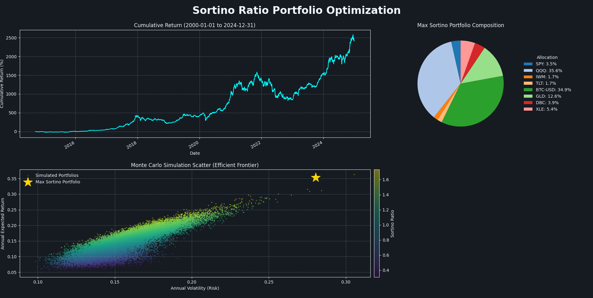

# Sortino Ratio Portfolio Optimizer


[](https://creativecommons.org/licenses/by-nc/4.0/)

---

## Project Showcase

This image demonstrates the unified, three-panel output generated by the application using the **`github-dark`** theme, showcasing the optimal portfolio's performance, composition, and risk profile.



## Project Overview

This project implements a quantitative finance tool designed for **Portfolio Optimization** with a primary focus on maximizing the **Sortino Ratio**. Unlike the standard Sharpe Ratio (which penalizes both positive and negative volatility), the Sortino Ratio focuses exclusively on **Downside Deviation (risk of loss)**, aligning the optimization goal with true risk management practices.

The system uses the Monte Carlo simulation technique to test thousands of random asset weight combinations, identifying the allocation that yields the highest return per unit of detrimental risk.

## Key Features

* **Sortino Ratio Maximization:** Optimizes portfolio allocation based on downside risk rather than total volatility.
* **Monte Carlo Simulation:** Quickly explores the feasible investment space to find the optimal portfolio composition.
* **Modular Architecture:** Structured into clear modules (`config.py`, `data.py`, `optimizer.py`, `plots.py`) for maintainability.
* **Professional Visualization:** Generates a unified, multi-panel plot using the `matplotx` library with the **`github-dark`** theme, displaying:
    * Cumulative Performance of the Optimal Portfolio.
    * Max Sortino Portfolio Composition (Pie Chart).
    * Efficient Frontier Scatter Plot colored by Sortino Ratio.

## Getting Started

### Prerequisites

Ensure you have Python 3.8 or newer installed.

### Installation

Clone the repository and install the required dependencies:

```bash
git clone [https://github.com/LucasRibeiroCaetano/Sortino-Ratio-Portfolio-Optimizer.git](https://github.com/LucasRibeiroCaetano/Sortino-Ratio-Portfolio-Optimizer.git)
cd Sortino-Ratio-Portfolio-Optimizer
pip install -r requirements.txt
```

### Run
In order to run the software, you can provide your preferred list of tickers (optional), aswell as the date for the analysis.
```bash
python main.py -t AAPL MSFT GOOGL NVDA
```
To see all available options:
```bash
python main.py --help | -h
```

---

## License
This project is licensed under the Creative Commons Attribution-NonCommercial 4.0 International License (CC BY-NC 4.0).

This means you are free to:

- Share: copy and redistribute the material in any medium or format.

- Adapt: remix, transform, and build upon the material.

Under the following terms:

- Attribution: You must give appropriate credit.

**NonCommercial**: You may not use the material for commercial purposes.

For the full license text, see: https://creativecommons.org/licenses/by-nc/4.0/

